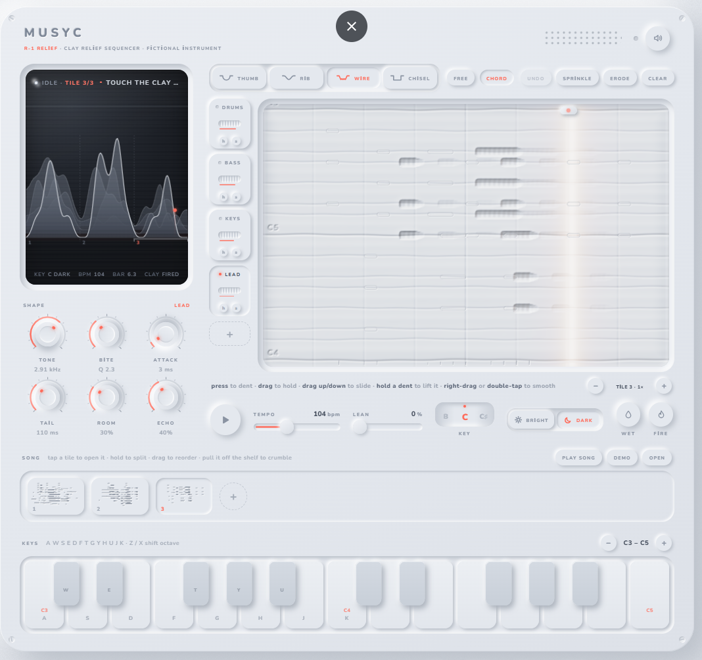

# Musyc Relief

**A song is a relief carved into soft clay. A light reads it.**

▶ **Play it:** https://erenciracioglu-dotcom.github.io/musyc-relief/

Musyc Relief is a fictional instrument that runs entirely in the browser. There is no grid and no note blocks: there is one slab of pale clay, and whatever you press into it becomes music. A warm, low light sweeps across the slab at the tempo; when it reaches a dent, the dent glows coral from inside and sounds.

- **Higher** on the slab is higher in pitch, **longer** is longer, **deeper** is louder.
- The **shape** of a dent is its sound: thumb (warm), rib (clean), wire (bright, ribbed), chisel (hollow).
- Six knobs reshape every dent live: **tone**, **bite** (crater rim), **attack** (entry wall), **tail** (trailing slope), **room** (ripples), **echo** (ghost dents).
- The clay has a **grain**: one line per note of the key. Dents settle onto it; pressing between lines makes the clay push back.
- **Slabs** for drums, bass, keys, lead (and more), **tiles** on a shelf for the song, a **horizon** screen that shows the whole song as a mountain range.
- **Wet** clay records what you play on the keys. **Fire** bakes the song into a WAV file.

## How to play

| Gesture | Result |
|---|---|
| Press | a dent and a tone (hold to press deeper) |
| Drag sideways | a held note (trench) |
| Drag up / down | a slide between pitches |
| Hold a dent, then drag | lift it and move it |
| Right-drag / double-tap | smooth dents away |
| Scroll on the field | zoom from the whole song down to a single crater |
| Drag the light | scrub |
| `A`–`K`, `Z` / `X` | play the keys, shift octave |
| `Space` | play / pause |
| `Ctrl Z` | undo |

Click **demo** for a four-tile sample song.

## Tech

One self-contained HTML file (`index.html`), no build step, no dependencies. The clay is a CPU heightmap lit by a WebGL2 shader (raking light with ray-marched shadows, glow, ripples), with a canvas fallback. All sound is synthesized live with the Web Audio API. Your song is saved in the browser's local storage.

Made with Claude.
